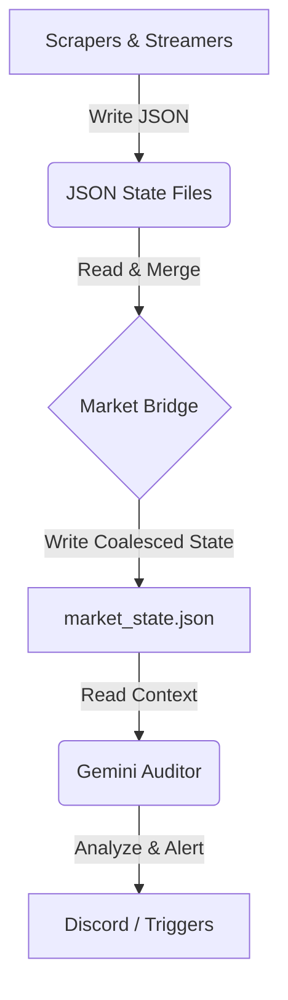

# System Context & Architecture

> [!IMPORTANT]
> This file is a living document of the Nexus Trading System architecture. Refer to this for server details, data flow, and stability protocols.

## 1. Server Information

> [!CAUTION]
> **CRITICAL ARCHITECTURE MANDATE**:
> The Nexus System MUST run in a **21-Window "Cockpit" Layout** inside Tmux.
>
> - **DO NOT** use a single supervisor script to run everything in one window.
> - **DO NOT** daemonize services into the background without a corresponding UI window.
> - Each service (Sweeps, Profilers, Greeks, etc.) MUST have its own dedicated interactive window.
> - This visual structure is essential for operator visibility and manual intervention.
> - The canonical launch script is `launch_cockpit.sh`.

| Component | Detail |
| :--- | :--- |
| **IP Address** | `<YOUR_VPS_IP>` |
| **User** | `root` |
| **Auth** | `<YOUR_VPS_PASSWORD>` (Root) |
| **Root Directory** | `/root/` (on remote server) |
| **Local Workspace** | `/Users/haydenscott/Desktop/Local Scripts/` |
| **Deployment** | via `remote_deploy.sh` (rsync/tar pipe) |
|> - **Restart Cmd** | `./launch_cockpit.sh` (manages 20 tmux windows)

## 2. Technology Stack

### Core Runtime

- **Language**: Python 3.10+
- **Environment**: Virtual Environment (`/root/.venv/bin/python3` for MTF_NEXUS)
- **Process Management**: `tmux` (Terminal Multiplexer) for detached sessions.

### Libraries & Frameworks

- **Asynchronous I/O**: `asyncio`, `aiohttp` (High-performance non-blocking I/O).
- **Messaging**: `pyzmq` (ZeroMQ) for inter-process communication (IPC) between components.
- **Data Analysis**: `pandas`, `numpy`, `scipy` (Financial math & time-series).
- **UI/TUI**: `textual` (Terminal User Interface for `ts_nexus.py`).
- **AI/LLM**: `google-generativeai` (Gemini Pro/Flash models).

## 3. API Integrations

The system relies on four primary external APIs:

### A. TradeStation (Execution & Data)

- **Role**: Primary execution gateway and real-time data source.
- **Auth**: OAuth2 via `tradestation_explorer.py`.
- **Usage**:
  - Fetches Quote Snapshots (`get_quote_snapshot`).
  - Streams Option Chains (`marketdata/stream/options/chain`).
  - Executes Orders (`orderexecution/orders`).

### B. ORATS (Derivatives Data)

- **Role**: Source of truth for Option Greeks and Intraday Volatility.
- **Script**: `orats_connector.py`.
- **Usage**: Provides Theta, Gamma, Vega, and IV Rank for accurate risk modeling.

### C. Google Gemini (Analysis)

- **Role**: "The Auditor" - AI Analyst Persona.
- **Script**: `gemini_market_auditor.py`.
- **Usage**: Receives the `market_state.json` payload, analyzes market structure, and outputs a JSON verdict with "Actions" (HOLD, HEDGE, CLOSE).

### D. Discord (Alerts)

- **Role**: Notification System.
- **Usage**: Webhooks for Trade Alerts, System Health Warnings, and Auditor Reports.

## 4. Server Environment & Data Flow

The system operates on a "Micro-Service" architecture where independent scripts produce JSON state files. These are coalesced into a single "Truth" file which feeds the AI.

### Data Flow Diagram



### Script -> JSON Mapping

| Script Name | Output JSON | Description |
| :--- | :--- | :--- |
| `nexus_sweeps_tui_v1.py` | `nexus_sweeps_v1.json` | Real-time option sweeps (Source 1) |
| `nexus_sweeps_tui_v2.py` | `nexus_sweeps_v2.json` | Real-time option sweeps (Source 2) |
| `spx_profiler_nexus.py` | `nexus_spx_profile.json` | SPX Market Profile (Inc. Sent Score) |
| `spy_profiler_nexus_v2.py` | `nexus_spy_flow_details.json` | SPY Flow Analysis (Inc. Sent Score V2) |
| `nexus_greeks.py` | `nexus_greeks.json` | Portfolio Risk/Greek exposure (Optimized: Smart Caching V3) |
| `structure_nexus.py` | `nexus_structure.json` | Market Structure (Walls, Gamma) |
| `watchtower_engine.py` | `market_state_live.json` | Anomaly Detection |
| `market_bridge_v2.py` | `market_state.json` | **[CRITICAL UPDATE]** Coalesced Truth Source (Replaces legacy bridge) |

### E. Strategic Narrative Integration (Jan 09 2026)

- **Data Source**: `spx_profiler_nexus.py` now calculates `trajectory` (Pressure/Magnet/Drift) in real-time.
- **Data Flow**: `nexus_spx_profile.json` -> `market_bridge_v2.py` -> `market_state.json` -> `gemini_market_auditor.py`.
- **Output**: Discord Alerts now feature a dedicated "Strategic Narrative" field.

### The "Bridge" (`market_bridge.py`)

# ... (Bridge details)

## 5. Operational Efficiency & API Limits

### A. Greeks Engine Optimization (Smart Caching)

To prevent API limit exhaustion (Unusual Whales limit: 15,000/day):

- **Problem**: Naive iteration fetching a full chain for every single leg caused ~1,200 requests/hour for a standard portfolio.
- **Solution**: `nexus_greeks.py` implements **Expiry-Grouped Caching**.
  1. Identifies all unique `(Ticker, Expiry)` tuples in the portfolio.
  2. Fetches the Option Chain **ONCE** per tuple.
  3. Performs local lookup for individual legs.
  4. **Result**: Reduces API calls by >50% for vertical spreads (2 legs per expiry).
- **Monitoring**: API Headers (`x-uw-daily-req-count`) are tracked and logged to `nexus_greeks.json` for Dashboard visibility.

This script checks the file modification times (freshness) of all JSONs above. It merges them into `market_state.json`. If a file is corrupted, it attempts to salvage it or mark it as STALE.

### 4.1 Adaptive Smart Execution (Limit Walker)

> [!NOTE]
> **Protocol Update (Jan 2026)**: The system now utilizes an **Adaptive Limit Walker** (`nexus_execution.py`) to minimize slippage on all Limit orders. Default execution is **NO LONGER** a static Limit or Market order.

- **Objective**: Execute orders at **Mid Price** and incrementally "walk" them toward the **Natural Price** (Bid/Ask) to capture spread.
- **Mechanism**:
  1. **Initial Submission**: Order placed at Mid Price.
  2. **Monitoring**: System checks fill status every 3 seconds.
  3. **Adjustment**: If unfilled, price is nudged by $0.01 (toward Natural) up to a max slippage cap (default $0.03).
  4. **Fallback**: If cap is reached without fill, order is canceled or potentially converted to Market (depending on configuration).
- **Integration**:
  - `execute_order` (Single Leg): Fully integrated. Returns OID upon fill.
  - `execute_spread` (Multi Leg): Integrated for Entry. Ensures complex spreads don't cross the spread aggressively.

## 5. Health Check & Stability Protocols

### C. Automated Health Checks

1. **System Watchdog**:
    - File: `system_watchdog.py`
    - Role: Monitors critical services (e.g., MTF Nexus) and restarts them if they disappear from the process list.
    - **Configuration**: Must point to the *exact* script path (e.g., `/root/trader_dashboard_v2.py`). Mismatches cause false-positive crash loops.
    - **Zombie Hunter**: Integrated daily cleanup routine (Default: 04:00 AM) that executes `nexus_zombie_hunter.py` to identify and terminate duplicate processes.

### D. ZMQ Robustness Pattern (The "Debit Sniper" Protocol)

    - **Issue**: Standard ZMQ REQ sockets enter a corrupted state if a request times out or errors, permanently blocking future requests.
    - **Solution**: Implement a `robust_send` wrapper that destroys and recreates the socket on failure.
    - **Critical Setting**: `setsockopt(zmq.LINGER, 0)` MUST be set on the socket. This forces immediate cleanup of the "stuck" connection.
    - **Timeout**: Client-side timeouts must exceed the maximum possible backend processing time (e.g., 45s for `GET_CHAIN`).
    - **Optimization**: The backend now uses `asyncio.gather` to fetch all 20 expirations in parallel (reduced latency from ~30s to <2s), making the 45s timeout a pure safety net.

### E. The Serial Latency Trap & Timeout Necessity

    *   **The Trap**: TradeStation's API can occasionally stall on a single request, hanging indefinitely if no timeout is set.
    *   **The Fix**: All `requests.get` calls in `ts_nexus.py` MUST have an explicit `timeout=` argument (e.g., `timeout=10`).
    *   **The Result**: If a fetch stalls, it fails fast (~10s), ensuring the ZMQ `REP` socket is never blocked for longer than the client's wait time. This prevents the "Endless Timeout Loop" where the backend becomes a zombie.

### E. Zombie Hunter

    - File: `nexus_zombie_hunter.py`
    - Role: Scans for scripts exceeding their allowed instance count (e.g., >2 for wrapped services) and terminates all instances to force a clean restart.
3. **Check System Health**:
    - File: `check_system_health.py`
    - Role: Manual diagnostic tool to list status of all Nexus services.
4. **Heartbeat Monitoring**:
    - Dashboard pulses a graphical heartbeat to indicate UI responsiveness.
    - `nexus_engine.log` is monitored for staleness.

### C. Corruption Handling

- **Mechanism**: `market_bridge.py` includes a `safe_read_json` method that detects "Extra data" errors (corruption).
- **Repair**: `repair_sweeps_json.py` can be run to truncate/fix corrupted JSON files automatically.

## 6. Trader Dashboard Logic

### A. Spread Calculation (P/L)

The `trader_dashboard.py` automatically groups individual option legs into Vertical Spreads if they meet specific criteria, assigning strategy labels based on the relationship between Short and Long strikes:

1. **Grouping Logic**: Matches positions with the **same timestamp** and **equal but opposite quantities** (+1 Long, -1 Short).
2. **Strategy Recognition**:
   - **Credit Put (Bull Put)**: Short Strike (`Sell`) > Long Strike (`Buy`).
   - **Debit Put (Bear Put)**: Long Strike (`Buy`) > Short Strike (`Sell`).
   - **Credit Call (Bear Call)**: Short Strike (`Sell`) < Long Strike (`Buy`).
   - **Debit Call (Bull Call)**: Long Strike (`Buy`) < Short Strike (`Sell`).
3. **Net P/L**: Calculated as `Short Leg P/L + Long Leg P/L`.
4. **Net Value**: Calculated as `Short Leg Market Value + Long Leg Market Value`.
5. **Cost Basis**: Derived as `Net Value - Net P/L`.
6. **P/L %**: `(Net P/L / abs(Cost Basis)) * 100`.

*Note: This allows the dashboard to display the "True" P/L of a credit spread, rather than showing one leg as a huge loser and the other as a winner.*

### C. Advanced Metrics (Spread Age & Expiry)

To assist with management, the Dashboard calculates derived metrics for Spreads:

1. **Expiry (DTE)**: Parsed from the leg with the nearest expiration date.
2. **Trade Age**: Calculated from the timestamp of the *oldest* leg in the spread (indicating when the structure was initiated).
   - Displayed as `Xd Xh` (Days/Hours) or `Xh Xm` (Hours/Minutes).

### B. Greek Calculations (Delta & Gamma)

Greeks are processed by `nexus_greeks.py` which serves as the risk engine.

1. **Source**: Greeks are **NOT** calculated locally (Black-Scholes is used only as a fallback in `orats_connector.py`). The primary source is the **Unusual Whales API**.
2. **Delta Calculation**:
    - Fetched from UW for the specific Option Contract.
    - **Formula**: `Position Delta = Contract Delta * (100 * Quantity)`.
3. **Gamma Calculation**:
    - Fetched from UW for the specific Option Contract.
    - **Formula**: `Position Gamma = Contract Gamma * (100 * Quantity)`.

*Note: The system prioritizes "Live" API data over theoretical models to account for real-world implied volatility surfaces.*

## 7. Snapshot Analysis & Kill Box Logic (Math & Formulas)

The `analyze_snapshots.py` script is the quantitative heart of the system. It ingests raw option chain data and transforms it into actionable "Traps" and "Kill Boxes".

### A. Data Ingestion

1. **Chains (ORATS)**: Fetches full option chain (Greeks, Volume, OI) from ORATS API.
2. **Flow (Unusual Whales)**: Fetches "Flow per Strike" to identify institutional aggression.
3. **Filtration (The "Noise" Filter)**:
   - **Gamma Horizon**: DTE > 60 is **HARD DELETED**. DTE 46-60 allowed *only* if Premium > $100M (Whale Exception).
   - **Zone of Engagement**: Strikes must be within **5%** of Spot Price.
   - **Impact Threshold**: Net Delta Notional must be > **$5M**.
   - **Junk**: Strikes > 30% OTM are discarded immediately.

### B. The "Kill Box" (Trap Detection)

A "Kill Box" identifies positions that are mathematically "Trapped" — meaning they are underwater and fighting against time decay (Theta).

#### 1. Breakeven Calculation

The system calculates the *effective* breakeven for the aggregated volume at a specific strike.

- **Avg Premium**: `Total Premium Traded / Total Volume`
- **Call Breakeven**: `Strike + (Avg Premium / 100)`
- **Put Breakeven**: `Strike - (Avg Premium / 100)`

#### 2. Trap Status

- **TRAPPED BULLS (Call Trap)**: `Target Spot Price < Call Breakeven`
  - *Meaning*: Buyers are long, but the price is below their cost basis.
- **TRAPPED BEARS (Put Trap)**: `Target Spot Price > Put Breakeven`
  - *Meaning*: Sellers/Puts are long, but the price is above their cost basis.

### C. Liquidation Engine (Days to Zero)

This metric determines *urgency*. It asks: "At the current rate of Theta decay, how many days until this position is worthless?"

- **Formula**: `Days Left = Avg Premium / |Daily Theta|`
- **Thresholds**:
  - **💀 LIQUIDATION**: `Days Left < 2.0` (Immediate forced selling expected).
  - **🔥 BURNING**: `Days Left < 5.0` (High urgency).

### D. Persistence & Structure Metrics

#### 1. "Ghost" vs "Fortress"

- **Ghost Strategy**: Identifies "False Flow".
  - *Condition*: `Volume > 1000` AND `OI Delta <= 0`.
  - *Meaning*: High volume was just churning or closing positions (not new money).
- **Fortress Strategy**: Identifies Accumulation.
  - *Condition*: Open Interest (OI) has increased for **3 consecutive days**.

#### 2. Flow Pain (Max Pain)

The price point where Market Makers would pay out the LEAST amount of money to option holders.

- **Logic**: Iterates through all strikes (`k`) and calculates the theoretical payout if the market expired at `k`.
- **Call Payout**: `(k - Strike) * Volume` (for In-The-Money calls).
- **Put Payout**: `(Strike - k) * Volume` (for In-The-Money puts).
- **Result**: The strike `k` that minimizes `Sum(Call Payout + Put Payout)`.

#### 3. Flow GEX (Gamma Exposure)

- **Formula**: `Gamma * Volume * Spot Price * 100`
- *Purpose*: Highlights strikes where Market Makers must hedge aggressively (Magnet Levels).

## 8. Coding & Refactoring Constraints (Strict)

### A. The "Do Not Touch" List

- **`market_bridge.py`**: This is the file system lock manager. Do not refactor its race-condition handling or sleep timers.

- **`tmux` logic**: Do not suggest replacing `tmux` with `systemd` or `docker`. The workflow relies on detached tmux sessions.
- **`remote_deploy.sh`**: Do not change the rsync flags.

### B. Python Guidelines

- **Type Hinting**: Mandatory for all *new* functions (`def my_func(a: int) -> str:`).

- **Async/Await**: This is an asynchronous system. Do not introduce blocking `time.sleep()` calls inside async loops; use `await asyncio.sleep()`.
- **Libraries**: Do not introduce new pip dependencies without asking. Stick to `textual`, `aiohttp`, `pandas`, `numpy`.

## 9. Automated Execution Strategy

The system uses a "Wait and Stalk" approach for entry, but a "Fire and Forget" approach for exits to ensure safety.

### A. Spread Execution Logic

1. **Entry (The Stalk)**:
    - Orders are submitted via `execute_spread` in **ts_nexus.py**.
    - Can be **Market** or **Limit** (usually Limit).

2. **Take Profit (Synthetic OCO Strategy)**:
    - **Concept**: We do *not* use broker-side OCO orders (too complex/brittle). We use a "Synthetic" approach.
    - **Limit Order**: As soon as the Entry Order is **FILLED**, a **GTC Limit Order** is automatically placed at the broker.
        - **Credit Spreads**: Target is **50% of Max Profit** (Buy to Close).
        - **Debit Spreads**: Target is **150% of Cost** (Sell to Close).
    - *Why?* This allows the position to close itself passively at the exchange without algorithm latency.

3. **Stop Loss (The Watchtower)**:
    - **Hidden Stop**: Stop losses are **NOT** sent to the broker (to hide from HFTs).
    - **Logic**: The internal **Watchtower** monitors the Underlying Price (SPY) in real-time.
    - **Trigger**: If Spot Price crosses the `stop_trigger`, the bot fires a **Market Close** order immediately.

### B. Fail-Safes & Race Condition Protocols

- **50% Guard (The Double-Tap Protection)**:
  - The `poll_account_data` loop checks Net P/L % every 3 seconds.
  - **Logic**: If P/L > 50% AND the position is still open:
        1. **CRITICAL**: The bot must **CANCEL** the existing GTC Limit Order first.
        2. **EXECUTE**: Only *after* cancellation confirmation, fire the Market Close order.
        3. *Reason*: Prevents "Double Execution" where the Broker fills the Limit and the Bot fills the Market order simultaneously, leaving you with an unintended naked position.

- **Smart Exit**: For directional bets, the bot tries to exit at **Mid-Price** first. If not filled within N seconds, it aggressively walks the limit price to crossings.

### C. Credit Spread Protocol (Income Mode)

1. **Stop Loss Logic (The "0.5 Gap" Rule)**:
    - **Logic**: Credit spreads are defined by the **Short Strike**. The stop must be tight enough to prevent a full breach but loose enough to endure noise.
    - **Formula**:
        - **Credit Call (Bear Call)**: Stop = `Short Strike - 0.5`. (Stops out before price fully breaches the Short Strike).
        - **Credit Put (Bull Put)**: Stop = `Short Strike + 0.5`.
    - *Reason*: A fixed 0.5 buffer is more reliable than a percentage-based stop for tight spreads, ensuring execution before the position goes deep ITM.

### D. Debit Spread Logic (Put/Call Distinction)

Different strategies require distinct risk parameters, especially when used for hedging vs. directional plays.

1. **Stop Loss Differentiator (Hedge Mode)**:
    - **Call Debit Spreads (Directional)**: Standard Stop = **0.99x** (1% below) Long Strike.
    - **Put Debit Spreads (Hedge)**: Looser Stop = **1.02x** (2% above) Long Strike.
    - *Reason*: Put spreads are often hedges; a 1% stop is too tight and triggers prematurely during normal volatility. 2% allows the hedge to "breathe".

2. **Panic Close Protocol (The Anti-Loop)**:
    - **Issue**: Standard `EXECUTE_SPREAD` commands can be ambiguous during a panic state.
    - **Protocol**: The Auto-Manager uses the explicit `CLOSE_SPREAD` command with `side="SELL"`.
    - **Logic**: This instructs the engine to **Sell Long / Buy Short** (reversing the Debit Open), specifically targeting the existing position to flatten it, rather than opening a new opposing position.

## 10 Discord Notification Architecture (Decoupled)

To prevent cosmetic or network failures from crashing critical trading logic, the system uses an **Event-Driven "Fire-and-Forget" Protocol**.

### A. The Problem & Solution

- **Old Way**: Logic scripts (e.g., `analyze_snapshots.py`) called `requests.post()` directly. If Discord hung, the math loop hung or crashed.
- **New Way**: Scripts push lightweight JSON messages to a local ZMQ port (`5575`). This is non-blocking (microseconds).

### B. Components

1. **Senders (Publishers)**:
    - `gemini_market_auditor.py`: Sends AI analysis.
    - `alert_manager.py`: Sends Guardian alerts.
    - `analyze_snapshots.py`: Sends Trap alerts.
    - *Logic*: They utilize `sock.send_json(payload, flags=zmq.NOBLOCK)`.

2. **Receiver (`nexus_notifications.py`)**:
    - A dedicated service running in the background.
    - Listens on Port `5575`.
    - Buffers messages and handles the slow HTTP requests to Discord.
    - **Stateful Topics**: Supports a `topic` field to *edit* the previous message (e.g. Dashboard).
    - **Note**: `GEMINI_AUDITOR` explicitly DISABLES this to send a fresh message every 15 minutes (Historical Log).

### C. Fail-Safety

- If the Notification Service crashes, the trading bots **continue running**. They simply drop alerts into the void, ensuring execution safety is prioritized over logging.

## 11. System Launch & Process Management

### A. The "Cockpit" Philosophy (20-Window Architecture)

The Nexus System is constructed as a **20-Window Tmux Session** named `nexus`. This architecture serves as the "Flight Deck," providing immediate visibility and manual control over every active service.

> [!NOTE]
> **Construction Logic**:
>
> - **Session**: Created via `tmux new-session -d -s nexus`.
> - **Windows**: 20 distinct windows are spawned using `tmux new-window`.
> - **Cleaning**: `launch_cockpit.sh` uses `pkill -9` (SIGKILL).
> - **Self-Defense**: Services use `nexus_lock.enforce_singleton()` (File Locks) instead of brittle PID killing.
> - **Visibility**: `set-option -g remain-on-exit on` ensures windows stay open after a crash for debugging.
> - **Signal Propagation**: `robust_wrapper.py` traps SIGTERM/SIGINT and forwards them to child processes, ensuring clean shutdowns and preventing zombies.
> - **Staggering**: Startups are randomized (1-2s).

### B. Window Map (The Canonical Layout)

| ID | Name | Script | Role |
| :--- | :--- | :--- | :--- |
| **0** | **CONTROL** | `htop` | System Resource Monitoring |
| **1** | **TS_NEXUS** | `ts_nexus.py` | **Core**: TradeStation Execution Engine |
| **2** | **WATCHTOWER** | `watchtower_engine.py` | **Core**: Stop-Loss & Anomaly Monitor |
| **3** | **SWEEPS_V2** | `nexus_sweeps_tui_v2.py` | **Data**: Option Sweeps Stream (Primary) |
| **4** | **SPARE** | `bash` | **Spare**: Legacy Sweeps V1 (Decommissioned) |
| **5** | **GREEKS** | `nexus_greeks.py` | **Math**: Portfolio Delta/Gamma Engine |
| **6** | **SPY_PROF** | `spy_profiler_nexus_v2.py` | **Data**: SPY Market Profile TUI |
| **7** | **STRUCTURE** | `structure_nexus.py` | **Data**: Gamma Walls & Pivot Points |
| **8** | **HISTORY** | `analyze_snapshots.py` | **Logic**: Anti-Gravity & Trap Analysis |
| **9** | **SPX_PROF** | `spx_profiler_nexus.py` | **Data**: SPX Profile (14-Day GEX) |
| **10** | **VIEWER_DASH**| `viewer_dash_nexus.py` | **UI**: Read-Only Dashboard Mirror |
| **11** | **HUNTER** | `nexus_hunter.py` | **Logic**: Trade Setup Scanner |
| **12** | **AUDITOR** | `gemini_market_auditor.py` | **AI**: Gemini Market Analyst |
| **13** | **DASHBOARD** | `trader_dashboard_v2.py` | **UI**: Manual Trading Interface |
| **14** | **UW_NEXUS** | `uw_nexus.py` | **Data**: Unusual Whales WebSocket |
| **15** | **SPREADS** | `nexus_spreads.py` | **Logic**: Spread Management Engine |
| **16** | **MTF_NEXUS** | `mtf_nexus.py` | **System**: Multi-Timeframe Analysis (Venv) |
| **17** | **DEBIT_SNIPER**| `nexus_debit.py` | **Logic**: Debit Spread Bot (Risk: Fixed Loss / Max Profit) |
| **18** | **NOTIFICATIONS**| `nexus_notifications.py`| **System**: ZMQ->Discord Router (MUST EXIST for Alerts) |
| **19** | **WATCHDOG** | `system_watchdog.py` | **System**: Health Monitor & Auto-Restarter |
| **20** | **HEDGE** | `nexus_hedge.py` | **Execution**: Future Hedge Engine (Dynamic Delta/Gamma) |

> [!NOTE]
> **Background Services**:
>
> - **BRIDGE** (`market_bridge.py`) runs in the background.
> - **ALERTS** (`alert_manager.py`) runs in the background.

### C. Hedge Integration (V3.1)

The **HEDGE** module (`nexus_hedge.py`) is now "Greek-Aware" and integrated with the Auditor:

1. **Ingestion**: Reads `market_state.json` (from `nexus_greeks.py`) to display **Portfolio Delta & Gamma** in the TUI.
2. **Export**: Writes `hedge_state.json` (Qty, Hedged Delta, PnL) to the local filesystem.
3. **Audit**: The **AUDITOR** (`gemini_market_auditor.py`) reads `hedge_state.json` and injects an "ACTIVE HEDGE" context into its analysis prompt, ensuring the AI sees the *net* risk profile.

### C. Robustness Wrapper

Every critical script is executed via `robust_wrapper.py` to prevent transient failures from killing the service.

- **Syntax**: `python3 robust_wrapper.py python3 script_name.py`
- **Function**:
  1. Executes the target script as a subprocess.
  2. Monitors return code.
  3. If Exit Code != 0 (Crash): Logs error and restarts after 5 seconds.
  4. If Exit Code == 0 (Clean): restarts immediately (loop mode).

## 12. Nexus Greeks & Risk Math (V3 Logic)

This section documents the specific logic used to calculate Portfolio Delta and Gamma, ensuring the system correctly handles complex multi-leg structures like Credit and Debit Spreads.

### A. Data Source & Iteration

1. **Source of Truth**: The `nexus_greeks.py` script reads `nexus_portfolio.json`.
2. **Spread Recognition**: It specifically looks for the `grouped_positions` list (generated by `trader_dashboard.py`), which contains valid Vertical Spreads.
3. **Granular Iteration**: The system **does not** approximate the spread as a single unit. Instead, it iterates through **EVERY LEG** independently:
    - **Short Legs** (Sold) are assigned a **Negative Quantity**.
    - **Long Legs** (Bought) are assigned a **Positive Quantity**.

### B. The Calculation Engine (Unusual Whales API)

For *each individual leg* (e.g., Short 672 Put, Long 667 Put), the system performs a real-time lookup:

1. **Fetch Dynamic Greeks**: Queries the Unusual Whales API for the specific Option Contract (Ticker + Expiry + Strike + Type).
2. **Apply Quantity**:
    - `Leg Delta = API Contract Delta * (100 * Leg Quantity)`
    - `Leg Gamma = API Contract Gamma * (100 * Leg Quantity)`
3. **Net Aggregation**:
    - `Portfolio Net Delta = Sum(All Leg Deltas)`
    - `Portfolio Net Gamma = Sum(All Leg Gammas)`

### C. Why This Matters (Credit vs Debit)

This logic allows the system to correctly differentiate strategies based on pure math, without needing "strategy tags":

- **Put Credit Spread (Bullish)**:
  - You Sell a Higher Delta/Gamma Put (Closer to ATM).
  - You Buy a Lower Delta/Gamma Put (Further OTM).
  - **Result**: Positive Net Delta, Negative Net Gamma.
- **Call Debit Spread (Bullish)**:
  - You Buy a Higher Delta/Gamma Call (Closer to ATM).
  - You Sell a Higher Delta/Gamma Call (Further OTM).
  - **Result**: Positive Net Delta, Positive Net Gamma.

> [!IMPORTANT]
> This "Sum of Parts" approach is the only way to guarantee accurate risk exposure values for complex, multi-leg portfolios.

## 13. TUI & Display Standards (Jan 2026 Update)

To ensure data visibility across different terminal sizes:

1. **Wide Layouts**: All DataTables (in `nexus_debit.py`, `ts_nexus.py`) must use **Wide Headers** (e.g., `LAST PRICE`) to force column expansion. "Compact" layouts cause truncation of 8-char prices (e.g., `6,967.00`).
2. **Strict Formatting**:
    - **Prices**: `{:,.2f}` (e.g., `6,967.00`) - Always 2 decimals, comma separated.
    - **Percentages**: `{:+.2f}%` (e.g., `+0.05%`) - Always signed, 2 decimals.
3. **Streaming Configuration**:
    - The `ALL_SYMBOLS` list in `ts_nexus.py` is the **Single Source of Truth** for the market data stream. Adding a ticker here propagates it to the entire system via ZMQ Port 5555.

4. **Profiler Standardization (SPY/SPX)**:
    - **SIDE Column**: Must explicity label `BOT`, `SOLD`, or `MID`.
        - `BOT`: Green (Aggressive Buying)
        - `SOLD`: Red (Aggressive Selling)
        - `MID`: Dim/Hidden (Passive)
    - **Filters**:
        - **V/OI**: Strictly `> 1.0`. High conviction only.
        - **DTE Buckets**: `0-3 DTE` (Gamma/Vega) vs `3+ DTE` (Delta/Theta).
    - **Sentiment Score ("Sent")**:
        - **Net Conviction**: Sum of `BULL (+1)` vs `BEAR (-1)` tags visible in the list.
        - **Purpose**: Provides a "Breadth" signal to complement "Depth" (Net Premium).

## 14. Gemini Market Auditor Protocol (V2)

The `gemini_market_auditor.py` script acts as the system's sentient overlay, determining the "Narrative" of the market. It follows a strict protocol for analysis and communication.

### A. Operational Schedule

- **Active Hours**: 09:00 ET (Pre-Market Analysis) to 16:15 ET (Close).
- **Cycle Frequency**: ~15 Minutes.
- **Sleep Mode**: Outside of active hours, the Auditor enters a Deep Sleep (4 hours) to save API costs.

### B. Position Recognition Logic (Dual Mode)

The Auditor automatically detects the complexity of the current portfolio:

1. **Single-Leg Mode (Directional)**:
    - Triggered when `ticker` is clearly defined (e.g., "SPY").
    - Analyzes Entry Price vs Current Price.
    - Direction: **BULLISH** (Call) or **BEARISH** (Put).

2. **Spread Portfolio Mode (Hedged)**:
    - Triggered when no single ticker is active, but `grouped_positions` contains Vertical Spreads.
    - **Logic**: Aggregates the Net P/L of ALL active spreads.
    - **Direction**: Classified as **HEDGED/SPREAD_GROUP**.
    - **Direction**: Classified as **HEDGED/SPREAD_GROUP**.
    - **Prompt Injection**: The AI receives the full list of spreads (iterating through `grouped_positions`) and is instructed to treat them as a unified book.
        - **Metrics**: Total Portfolio Value, Total Portfolio P/L.
        - **Context**: "You are auditing a multi-spread portfolio..."

3. **Sentiment Integration (Breadth vs Depth)**:
    - **Source**: Reads `nexus_spx_profile.json` and `nexus_spy_flow_details.json`.
    - **Logic**: Divergence Analysis.
        - **Depth**: Net Premium Flow (Real Money).
        - **Breadth**: Sentiment Score (Conviction Tags: -10 to +10).
    - **Signal**:
        - **Accumulation**: Money Buying (Depth +) but Sentiment Low/Bearish.
        - **Distribution**: Money Selling (Depth -) but Sentiment High/Bullish.

### C. ZeroMQ Notification Pipeline

To prevent rate-limits and blocking behavior, the Auditor does **not** send Discord requests directly.

1. **Source**: `gemini_market_auditor.py` generates the analysis.
2. **Transport**: Pushes a JSON payload via ZeroMQ (PUSH) to `localhost:5575`.
3. **Router**: `nexus_notifications.py` (Running in **Window 20**) receives the payload (PULL).
4. **Delivery**: The Router handles the HTTP Request to Discord, **editing** the previous message if the topic (`GEMINI_AUDITOR`) matches, ensuring a clean channel history.
5. **Rich Fields**: The payload includes a `fields` array containing detailed Position Metrics (P/L, Entry), Performance Stats, and Greeks (Delta/Gamma/Theta).

## 15. Server Directory Routing

> [!IMPORTANT]
> The server filesystem is flat but has specific routing for critical components.

| Path | Purpose | Scripts |
| :--- | :--- | :--- |
| `/root/` | **Application Root** | `trader_dashboard.py`, `ts_nexus.py`, `watchtower_engine.py` |
| `/root/nexus_trading/` | **Backup Directory** | Redundant copies of core scripts (often causes version syncing issues). |
| `/root/snapshots/` | **Data Storage** | Stores JSON state files (`market_state.json`) and historical snapshots. |
| `/root/__pycache__/` | **Python Cache** | Compilation artifacts. Cleared via `nuke_and_pave.exp`. |

### Critical File Locations

- **Dashboard**: `/root/trader_dashboard.py` (Primary execution path).
- **Wrapper**: `/root/robust_wrapper.py` (Supervisor process).
- **Logs**: `/root/*.log` and `/tmp/*.log`.

## 16. ZMQ Port Registry (Internal Network)

This registry maps all ZeroMQ ports used for Inter-Process Communication (IPC) within the Nexus Cockpit.

| Port | Service (Publisher) | Subscriber(s) | Function |
| :--- | :--- | :--- | :--- |
| **5555** | `ts_nexus.py` | Profilers, Dashboard | **Market Data Stream**: Real-time price/quote updates. |
| **5556** | `ts_nexus.py` | Dashboard | **Execution Stream**: Order fills and status updates. |
| **5557** | `gemini_market_auditor.py` | Notifications | **Analysis Push**: AI Market Verdicts. |
| **5560** | `spy_profiler_nexus_v2.py` | `trader_dashboard.py` | **Select Link**: Highlights specific contract in Dashboard when selected in Profiler. |
| **5571** | `spx_profiler_nexus.py` | Dashboard | **SPX Flow**: Real-time GEX/Flow updates. |
| **5573** | `spy_profiler_nexus_v2.py` | Dashboard | **SPY Flow**: Real-time GEX/Flow updates. |
| **5575** | `nexus_notifications.py` | (Bind Port) | **Notification Router**: Central hub for Discord messages. |

> [!NOTE]
> **Bind Logic**: Publishers `bind()` to these ports. Subscribers `connect()`.
> **Retry Policy**: All bindings implement a **15-second Retry Loop** with `zmq.LINGER=0` to handle `TIME_WAIT` states on restart.

## 17. Optimization & Debugging Protocols (Agent Instructions)

This section mandates specific workflows for future agents debugging system stability or deployment issues.

### A. The "Zombie Process" Protocol (Nuclear Restart)

**Symptom**: You updated a script (e.g., `trader_dashboard.py`), verified the code is correct, restarted the service via `C-c` or Watchdog, but the behavior (or bug) persists unchanged.

**Diagnosis**: The old process did not die. It is a "Zombie" holding the port or memory state, preventing the new code from loading.

**Mandatory Action**:

1. **Verify**: Run `ps -ef | grep [script_name]`. Check the **Running Time** (Time column). If it's `> 00:00:05` after a supposed restart, it's a zombie.
2. **Kill**: do NOT use `pkill [script]`. Use `pkill -9 -f [script_name]` (SIGKILL).
3. **Verify Again**: Run the `ps` check again to confirm emptiness.
4. **Restart**: Only then launch the new instance.

### B. The "Ghost Window" Protocol (Missing Pane)

**Symptom**: A service (e.g., Notifications) IS NOT working, but you think it's running.
**Diagnosis**: The tmux window may have crashed, closed, or never been created.

**Mandatory Action**:

1. **Audit**: Run `tmux list-windows`.
2. **Verify**: Check for the SPECIFIC ID (e.g., `18: NOTIFICATIONS`).
3. **Trap**: Do NOT assume `18` exists just because `19` exists. Windows can be sparse.
4. **Fix**: If missing, use the "Interactive Restoration" protocol below to recreate it.

### C. The "Notification Pipeline" Protocol (Silence Diagnosis)

**Symptom**: "I did not receive a Discord message."
**Chain of Custody**:

1. **Auditor/Script**: Pushes JSON to ZMQ Port `5575`. (Logs: "Analysis pushed to ZMQ").
2. **Router (Window 18)**: Listens on `5575`. (Logs: "Forwarding to Discord").
3. **Discord API**: Accepts the HTTP POST.

**Debug Steps**:

1. **Check Window 12 (Auditor)**: Did it print "Analysis pushed"?
   - NO -> Fix Auditor logic/keys.
   - YES -> Proceed to Step 2.
2. **Check Window 18 (Router)**: DOES IT EXIST?
   - Run `tmux list-windows | grep 18`.
   - **Critical Failure**: If Window 18 is missing, the message was sent into a void.
   - **Fix**: Launch `nexus_notifications.py` in Window 18 immediately.
3. **Check Window 18 Logs**: Did it crash processing the message?
   - Use `tmux capture-pane -pt 18`.
   - Look for `KeyError` or `Formatting Error` in the embed fields.

### D. The "CWD Trap" Protocol (Pathing Errors)

**Symptom**: A script runs but fails to read local JSON files (e.g., `market_bridge.py` reporting "File Not Found"), even though the file exists.
**Cause**: The process was launched from a directory other than `/root/` (e.g., via `nohup` in a sub-folder), breaking relative path resolution.

**Mandatory Action**:

1. **Kill**: Terminate the zombie process (`pkill -9`).
2. **CD**: explicitly `cd /root/` before launching.
3. **Launch**: `nohup python3 robust_wrapper.py python3 script.py > log 2>&1 &`

### B. The "Watchdog Creation" Protocol

**Rule**: When patching `system_watchdog.py`, you MUST ensure it can **create** windows, not just send keys to them.

- **Good**: Check `tmux list-windows`. If missing, use `tmux new-window -n NAME ...`.

### F. The "Interactive Restoration" Protocol (Persistent Debugging)

**Symptom**: You try to launch a window remotely (`tmux new-window ... 'python3 script.py'`), and it immediately vanishes or fails to appear in `list-windows`.

**Cause**: The process inside is crashing instantly (e.g., Syntax Error, Import Error), causing the shell to exit and the window to close before you can see the error.

**Mandatory Action**:

1. **Launch Stable Shell**: Create the window running *only* `bash` first.
    - `tmux new-window -t [ID] -n [NAME] 'bash'`
2. **Inject Command**: Use `send-keys` to type the command into the stable window.
    - `tmux send-keys -t [ID] 'python3 robust_wrapper.py python3 script.py' C-m`
3. **Result**: If the script crashes, the `bash` shell remains open, preserving the traceback/error log for you to read.

### G. The "Remote Scripting" Standard

**Rule**: Do NOT attempt to pipe complex, multi-line logic through a single `ssh` command string. It is brittle and creates escaping hell.

**Standard**:

1. **Create Local Script**: Write a temporary `.exp` (Expect) or `.sh` script on your local machine.
2. **Permissions**: `chmod +x script.exp`.
3. **Execute**: `./script.exp [PASSWORD]`.
4. **Benefit**: Handles interactive prompts (sudo/ssh password), complex regex matching, and conditional logic robustly.

### C. The "Local Calculation" Mandate (Dashboard Data)

**Context**: Broker APIs (TradeStation/Schwab) often send "Zero" or "Stale" values for aggregated account metrics (e.g., `UnrealizedProfitLoss`, `Value`) during high-load or streaming catch-up.

**Rule**: The Dashboard MUST calculate these top-level metrics locally.

- **Source**: Trust the calculated sum over the `AccountBalance` fields from the broker feed. This prevents the "0.00% P/L" bug.

### D. The "Non-Blocking" Mandate (API Calls)

**Issue**: The most common cause of "System Freeze" or "ZMQ Blackout" is a hidden synchronous network call inside an async loop.

**Rule**: EVERY `requests.get/post` call must have an explicit `timeout=` argument.

- **Good**: `requests.get(url, timeout=10)`
- **Bad**: `requests.get(url)` (Default timeout is infinite!)

**Reason**: If the Broker API stalls, an infinite timeout blocks the *entire* python process (GIL), freezing all Heartbeats and ZMQ listeners. This looks like a crash but is actually a hang.

### E. ZMQ Hygiene (Socket Isolation)

**Issue**: A single `REP` (Reply) socket cannot handle high-frequency status polling AND critical execution commands simultaneously. One "heavy" request blocks the port for everyone.

**Rule**:

1. **Critical Commands** (e.g., `Panic Close`) should use a dedicated port OR high-priority queue if possible.
2. **Status Polling**: Should be done via `PUB/SUB` (Fire hose) rather than `REQ/REP` (Question/Answer) whenever possible to reduce load on the execution thread.
3. **Emergency Override**: Always keep a `manual_override.py` script handy that connects DIRECTLY to the execution port, bypassing the UI. If the UI is the problem (DDOS), killing the UI window clears the path for the manual script.

## 18. ZMQ Multi-Client Architecture (V2)

> [!IMPORTANT]
> **Deployed**: Jan 08, 2026
> **Purpose**: Solves the "Starvation" and "Blocking" issues inherent in `REQ/REP` sockets when multiple clients (Dashboard, Hedge Script, Auditor) compete for the Execution Engine.

### A. The "Router/Dealer" Pattern

- **Server (`ts_nexus.py`)**:
  - **Socket Type**: `zmq.ROUTER`
  - **Behavior**: Asynchronous execution. It receives a multipart message containing the sender's `Identity`, routes the request to `asyncio` handling, and sends the reply *only* to that specific Identity.
  - **Port**: `5567` (EXEC)

- **Clients (`nexus_hedge.py`, `trader_dashboard_v2.py`)**:
  - **Socket Type**: `zmq.DEALER`
  - **Mandate 1 (Identity)**: The client **MUST** set a unique Identity via `setsockopt(zmq.IDENTITY, b'UNIQUE_ID')` *before* connecting.
    - *Format*: `HEDGE_POS_<timestamp>` or `DASH_EXEC_<timestamp>`.
    - *Reason*: Without this, the ROUTER sees a generic binary ID. If the connection drops, the server might try to reply to the dead ID. Explicit IDs allow session persistence.
  - **Mandate 2 (HWM)**: `setsockopt(zmq.RCVHWM, 0)` and `SNDHWM, 0` (Unlimited).
    - *Reason*: Prevents the internal buffer from filling up and silently dropping messages if the main loop is slow.

### B. The Segmented Polling Pattern (TUI Stability)

> [!TIP]
> **Problem**: `await socket.poll(10000)` blocks the Thread/Event Loop for 10 seconds. In a TUI (Textual), this freezes the UI and makes the application look "Dead".
> **Solution**: Segmented Polling Loop.

```python
# Instead of blocking 10s:
for _ in range(100):
   if await req.poll(100):  # Check for 100ms
       msg = await req.recv_multipart()
       break
   # Implicit yields allow Textual to draw the UI
```

## 19. Hardware & Resource Mandates

### A. CPU Starvation Warning

- **Symptom**: "Pos Fetch Timeout" or "ZMQ Blackout" despite code correctness.
- **Cause**: Heavy scripts (e.g., `analyze_snapshots.py` parsing 5,000 strikes) can pinning a CPU core to 100%.
- **Impact**: The OS schedules the "heavy" script over the latency-sensitive `ts_nexus` script. Packets arrive but sit in the buffer processing.
- **Requirement**: The Host Server **MUST** have at least **4 Physical Cores**.
- **Mitigation**: Use `asyncio.sleep(0.1)` in heavy loops (`spy_profiler`, `analyze_snapshots`) to yield cycles back to the OS.

## 5. Operations & Incident Log (Jan 2026)

### [INCIDENT] The Ghost Process / Bridge Decoupling (Jan 09)
- **Symptom**: `market_bridge.py` refused to propagate new JSON keys ("trajectory") despite verified code updates on the server.
- **Root Cause**: The running Python process became "decoupled" from the file on disk (likely inode mismatch or file locking phantom), causing it to run stale logic indefinitely despite restart attempts via `pkill`.
- **Resolution**:
  1. Cloned `market_bridge.py` to a unique filename: `market_bridge_v2.py`.
  2. Updated `launch_cockpit.sh` to reference V2.
  3. Performed Nuclear Restart.

### [INCIDENT] Cockpit Fragmentation (Jan 09)
- **Symptom**: "Teamwork Session" window count dropped from 20 to 4. All services died.
- **Cause**: Likely collateral damage from the aggressive process killing required to fix the Ghost Process, or resource exhaustion.
- **Resolution**:
  1. Patched `launch_cockpit.sh` with V2 bridge logic.
  2. Executed full session rebuild (kill-server -> new-session).
  3. **Verified Stability**: All 20 windows operational.

### [REGRESSION FIX] Window 8 TUI
- **Issue**: Window 8 (`analyze_snapshots.py`) was left in `--headless` mode, spamming logs instead of TUI.
- **Fix**: Removed flag in restore script. TUI restored.
